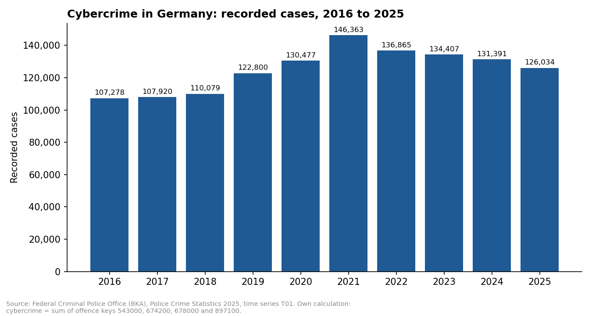
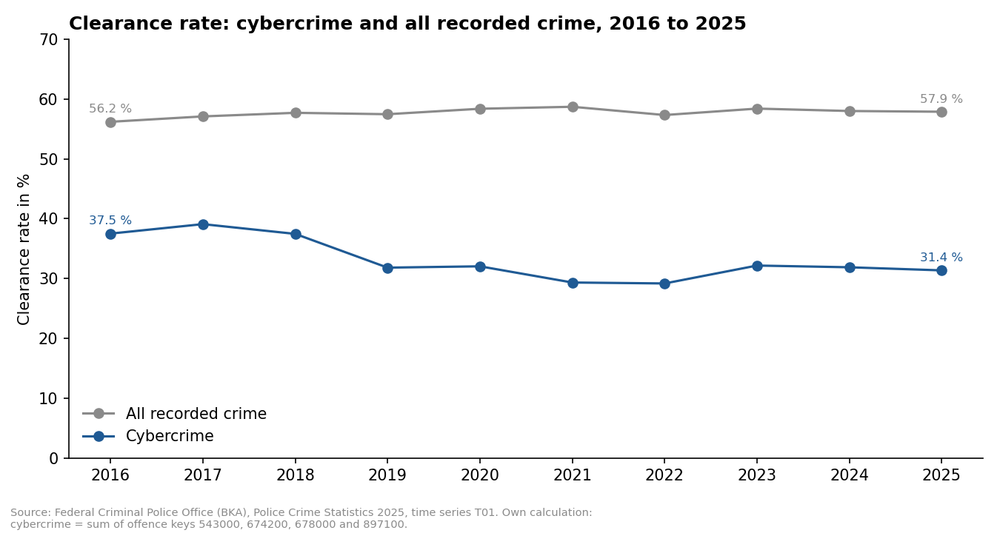
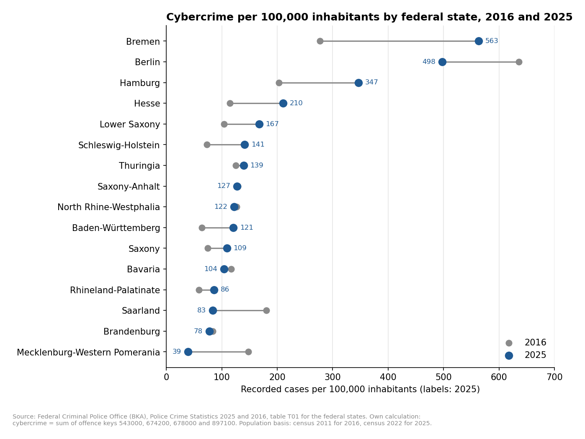

# Cybercrime in Germany, 2016 to 2025

**Recorded cases, clearance rate and differences between the federal states, based on the Police Crime Statistics of the Federal Criminal Police Office (BKA)**

🇩🇪 [Deutsche Fassung](README.de.md)

This project looks at how cybercrime recorded by the German police has developed over ten years. It is based on the official Police Crime Statistics (Polizeiliche Kriminalstatistik, PKS), which the BKA publishes every year.

The analysis answers three questions. How did the number of cases develop? How many of these cases does the police clear, compared with crime in general? And how much do the 16 federal states differ from each other?

The full analysis is in the notebook [`cybercrime_germany_pks.ipynb`](notebooks/cybercrime_germany_pks.ipynb). There is also an interactive [dashboard](https://cybercrime-germany-pks.streamlit.app/) in English and German.

## What counts as cybercrime here

I did not decide myself which offences belong to cybercrime. The project uses the definition of the BKA, the aggregate key 897000 "Cybercrime", which is the sum of four offence keys:

| Key | Offence | German Criminal Code |
|---|---|---|
| 543000 | Forgery of data intended to provide proof, deception in legal commerce through data processing | §§ 269, 270 StGB |
| 674200 | Data tampering, computer sabotage | §§ 303a, 303b StGB |
| 678000 | Data espionage and interception of data including preparatory acts, handling of stolen data | §§ 202a to 202d StGB |
| 897100 | Computer fraud | § 263a StGB |

In practice this means mostly computer fraud, which made up 82 % of the cases in 2025.

One detail mattered for the comparison over time. Until 2020 the BKA also counted software piracy under this key, and since 2021 it no longer does. To compare the same offences in every year, I calculated cybercrime as the sum of the four keys for the whole period instead of using the published total. The values calculated this way for 2020 to 2022 match the figures the BKA itself gives in its [situation report on cybercrime for 2022](https://www.bka.de/SharedDocs/Downloads/DE/Publikationen/JahresberichteUndLagebilder/Cybercrime/cybercrimeBundeslagebild2022.pdf?__blob=publicationFile&v=4) (page 5). The period starts in 2016 because the key for computer fraud was introduced in that year, and the BKA marks the figures of 2016 as not comparable with 2015.

## 1. How did the number of cases develop?



Recorded cybercrime rose from 107,278 cases in 2016 to a peak of 146,363 in 2021 and has fallen in every year since. In 2025 the police recorded 126,034 cases, which is 14 % below the peak but still 17 % above 2016. Over the same ten years all recorded crime fell by 14 %, so cybercrime has gained weight: its share of all recorded crime grew from 1.7 % to 2.3 %.

The statistics show this development but not its causes. The BKA comments on them in its situation reports. It links the rise up to 2021 to the digitalisation that the COVID-19 pandemic accelerated and that created new opportunities for offenders ([press release of 9 May 2022](https://www.presseportal.de/blaulicht/pm/7/5217298)). It explains the decline in 2022 with the easing of the pandemic measures: online shopping and remote work had offered additional opportunities for attacks in the years before, and in 2022 part of the crime moved back into the analogue world ([Bundeslagebild Cybercrime 2022](https://www.bka.de/SharedDocs/Downloads/DE/Publikationen/JahresberichteUndLagebilder/Cybercrime/cybercrimeBundeslagebild2022.pdf?__blob=publicationFile&v=4), page 7). About Russia's war against Ukraine, which began on 24 February 2022, the BKA writes that it led to a heightened cyber threat situation in Germany as well (page 22). The cases recorded in the PKS nevertheless fell in 2022.

The BKA itself calls this decline an apparent one. The statistics used here only contain offences committed in Germany. Offences that cause damage in Germany while the offender is abroad or at an unknown location have been recorded separately since 2020. These offences rose by more than 8 % in 2022, while the domestic cases fell by 6.5 % (Bundeslagebild 2022, page 6).

## 2. How many cases are cleared?



Fewer than one in three. The clearance rate of cybercrime fell from 37.5 % in 2016 to 31.4 % in 2025, while the rate for all recorded crime stayed between 56 % and 59 % in every year. The gap between the two grew from 19 to 27 percentage points.

The drop came in one step between 2018 and 2019, and the rate has stayed at around 30 % since. The number of cleared cases hardly changed in these ten years, at roughly 39,000 to 43,000 per year, while the number of recorded cases grew.

## 3. How do the federal states differ?



The differences are very large. In 2025 Bremen recorded 563 cases per 100,000 inhabitants and Mecklenburg-Western Pomerania 39, a factor of 14.5. The three city states Berlin, Bremen and Hamburg hold the first three ranks in 2016 and in 2025, so their high level is not the outlier of a single year. Below them the ranking is unstable: the rate roughly doubled in Bremen and fell by three quarters in Mecklenburg-Western Pomerania.

Bremen stands out even among the city states, and I looked into why. Almost half of its value comes from a single offence key, computer fraud with unlawfully obtained non-cash means of payment other than payment cards (key 516920). Bremen recorded 257 such cases per 100,000 inhabitants in 2025, 17 times the national rate, while Berlin and Hamburg are at 11. Without this one key Bremen would be below both. Why this key is so high in Bremen in particular does not follow from the published tables. The rise is not new, however: for 2022 the [Weser-Kurier](https://www.weser-kurier.de/bremen/politik/bremer-kriminalstatistik-immer-mehr-digitale-straftaten-doc7p7nodmh7tg1b8franvb) (6 March 2023) reported that computer fraud with stolen non-cash means of payment in Bremen had more than doubled within one year, from 968 to 2,136 cases. According to the report, the Bremen State Criminal Police Office sees this rise favoured by the growing use of electronic payment methods such as Apple Pay and Google Pay.

This applies to the state comparison as a whole. The rates changed between −74 % and +103 % from 2016 to 2025. The tables do not show where these differences come from, and the BKA notes on the PKS 2025 list no special circumstance for any state in this field. In general the BKA points out that high rates of increase are partly due to investigation complexes with numerous individual cases. Whether this applies to a particular state does not follow from the tables.

## What the data cannot show

The Police Crime Statistics count only what becomes known to the police. According to the BKA, studies estimate the unreported share of cybercrime at up to 91.5 %. The BKA therefore writes that the PKS has only limited informative value for the cyber offences actually committed and is suited mainly for statements on the trend ([Bundeslagebild Cybercrime 2022](https://www.bka.de/SharedDocs/Downloads/DE/Publikationen/JahresberichteUndLagebilder/Cybercrime/cybercrimeBundeslagebild2022.pdf?__blob=publicationFile&v=4), page 4).

The figures are also narrower than the word "cybercrime" suggests. Since 2014 a case is only counted when there are concrete indications that the act was carried out in Germany. Offences committed with the internet as a tool are published by the BKA in a separate table and are not included here.

Three technical points limit the precision. The clearance rates before 2019 are approximations, because the BKA published them with only one decimal place and I calculated the cleared cases back from them. The rates per 100,000 inhabitants are based on the census of 2011 for 2016 and on the census of 2022 for 2025, which the BKA describes as comparable only to a limited extent. And the state comparison has two points in time, 2016 and 2025, not the years in between.

## Running the project

```
├── app.py                               Streamlit dashboard (English / German)
├── requirements.txt
├── notebooks/
│   └── cybercrime_germany_pks.ipynb     Loading, checks, analysis, charts
├── data/
│   ├── raw/                             Original BKA tables and notes
│   └── clean/                           Result tables used by the dashboard
└── figures/                             The three charts as PNG
```

The notebook reads the three Excel files in `data/raw`, checks them, calculates the results and writes two small tables to `data/clean` and the charts to `figures`. The dashboard runs online at https://cybercrime-germany-pks.streamlit.app/ and reads these two tables. To start it locally:

```bash
pip install -r requirements.txt
streamlit run app.py
```

## Sources

All data comes from the Federal Criminal Police Office (Bundeskriminalamt, BKA), Police Crime Statistics (Polizeiliche Kriminalstatistik, PKS). The BKA allows reproduction only with attribution. The cybercrime figures before 2021, the clearance rates before 2021 and the state rates for 2016 are my own calculations based on these tables.

| Used for | Table or document | Version |
|---|---|---|
| Cases and clearance rate, federal level | PKS 2025, time series, T01 Grundtabelle – Fälle ab 1987 | V1.1, 8 April 2026 |
| Federal states 2025 | PKS 2025, T01 Grundtabelle – Fälle mit Häufigkeitszahl (HZ) – Länder | V1.0, 6 March 2026 |
| Federal states 2016 | PKS 2016, T01 Grundtabelle – Länder | 27 January 2017 |
| BKA notes on comparability and rates of increase | PKS 2016, T01 Grundtabelle – Länder – Fallentwicklung | 1 February 2017 |
| Definition of cybercrime | PKS 2025 – Übersicht Summenschlüssel, page 9 | V1.0 |
| Changes of recording and keys | PKS 2025 – Hinweise zu den Zeitreihen, pages 19, 23 and 40 | V1.0 |
| Population basis, notes on the states | PKS 2025 – Wichtige Hinweise zur Interpretation der Daten, pages 4 to 6 | V1.0 |

The tables are available on the BKA website: [PKS 2025, tables and notes](https://www.bka.de/DE/AktuelleInformationen/StatistikenLagebilder/PolizeilicheKriminalstatistik/PKS2025/pksTabellen_Interpretationshilfen/pksTabellen_Interpretationshilfen_node.html), [PKS 2025, time series](https://www.bka.de/DE/AktuelleInformationen/StatistikenLagebilder/PolizeilicheKriminalstatistik/PKS2025/pksTabellen_Interpretationshilfen/Zeitreihen/zeitreihen_node.html) and [all reporting years, including 2016](https://www.bka.de/DE/AktuelleInformationen/StatistikenLagebilder/PolizeilicheKriminalstatistik/pks_node.html). The sources linked in the text were used for context only, not for calculations: the BKA press release on the Bundeslagebild Cybercrime 2021, the Bundeslagebild Cybercrime 2022 (pages 4 to 7 and 22) and the report of the Weser-Kurier of 6 March 2023.

## Tools and use of AI

Python (pandas, matplotlib, Plotly), Jupyter and Streamlit. The project was built mainly with Claude (Anthropic) for code and text, and ChatGPT (OpenAI) was used for the final check; the questions, decisions and checks are mine. How I work with AI is described in my repository [local-ai-workflow](https://github.com/Amirhouschang/local-ai-workflow).

---

© 2026 Amirhoushang Rahmannejad. All rights reserved.
